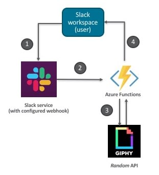

# Build a Serverless app using Go and Azure Functions

Learn how to implement a [Slack app](https://api.slack.com/start/overview#apps) as a Serverless backend using [Azure Functions Custom Handlers](https://docs.microsoft.com/azure/azure-functions/functions-custom-handlers?WT.mc_id=data-9656-abhishgu) and [Go](https://golang.org/)

[blog post link coming soon!]
